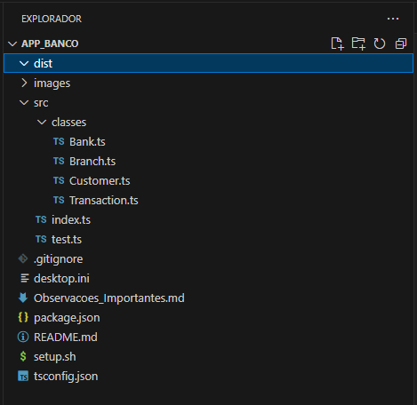
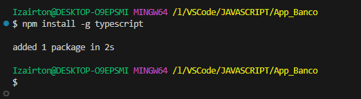
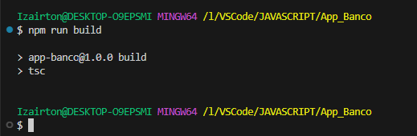
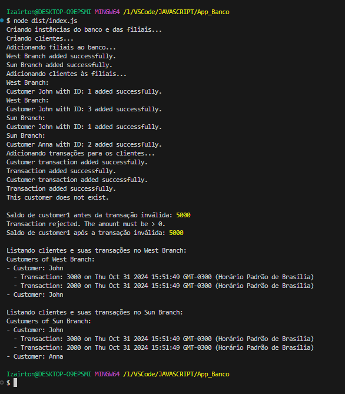
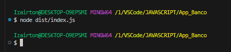

# Projeto Bancário em TypeScript

## Objetivo

Este projeto tem como objetivo criar uma aplicação bancária simples utilizando TypeScript e conceitos de Programação Orientada a Objetos (POO). O sistema é capaz de gerenciar um banco com múltiplas filiais, onde cada filial pode cadastrar clientes e registrar suas transações financeiras. Esse projeto é ideal para iniciantes que desejam aprender sobre POO, TypeScript e estruturação de projetos.

## Funcionalidades

1. **Cadastro de Filiais:** Possibilidade de adicionar múltiplas filiais ao banco.
2. **Cadastro de Clientes:** Cada filial pode cadastrar e gerenciar seus próprios clientes.
3. **Registro de Transações:** Clientes podem realizar transações financeiras, que são registradas com data e valor.
4. **Cálculo de Saldo:** O sistema calcula automaticamente o saldo de cada cliente com base nas transações registradas.
5. **Listagem de Clientes e Transações:** Possibilidade de listar todos os clientes de uma filial e visualizar suas transações.

## Importância Prática para o Usuário

Este projeto é importante para usuários que desejam um sistema de gerenciamento financeiro básico, seja para controle pessoal, pequenas cooperativas de crédito ou bancos de pequeno porte. Abaixo estão alguns motivos pelos quais essa aplicação é útil na prática:

1. Organização e Controle Financeiro:
    - A aplicação oferece uma estrutura para organizar informações financeiras em um só lugar. Com ela, é possível registrar todas as transações de cada cliente de maneira organizada, facilitando a análise e o controle dos dados financeiros.

2. Facilidade de Uso:
    - Esta aplicação foi construída com uma interface simples para quem está começando a aprender programação. O usuário pode realizar operações como adicionar clientes, cadastrar transações e calcular saldos sem complexidade, tornando o gerenciamento financeiro mais acessível.

3. Transparência e Histórico Financeiro:
    - Com o registro detalhado de cada transação e a possibilidade de listar todas as movimentações, os usuários têm acesso a um histórico financeiro claro. Isso é útil para clientes que desejam acompanhar seu saldo e transações, além de auxiliar bancos na prestação de contas e transparência financeira.

4. Segurança e Precisão:
    - O uso do TypeScript garante que todos os dados sejam tipados, reduzindo a chance de erros. A aplicação também rejeita transações inválidas (como valores negativos), o que evita possíveis erros ou inconsistências nos dados financeiros.

5. Escalabilidade e Expansão:
    - Mesmo sendo uma aplicação básica, a estrutura modular permite expandir as funcionalidades facilmente. Usuários ou desenvolvedores podem adicionar novas funcionalidades, como relatórios financeiros e consultas personalizadas, sem alterar a base principal do código. Essa flexibilidade torna o projeto útil para pequenas empresas ou cooperativas que desejam evoluir o sistema com o tempo.

6. Aprendizado e Desenvolvimento de Habilidades:
    - Além de ser uma ferramenta prática para gestão bancária, este projeto é uma ótima introdução para quem deseja aprender Programação Orientada a Objetos (POO) e TypeScript. O projeto é ideal para iniciantes que buscam entender como criar um sistema completo, utilizando boas práticas e organização de código.

## Tecnologias Utilizadas

1. **TypeScript:** Linguagem de programação com tipagem estática para maior segurança e manutenibilidade.
2. **Node.js:** Plataforma para executar o código JavaScript no servidor.
3. **npm:** Gerenciador de pacotes do Node.js.

## Estrutura do Projeto

O projeto segue uma estrutura organizada em pastas para facilitar a navegação e o entendimento:

    App_Banco
    │
    |── images
    ├── src
    │   ├── classes
    │   │   ├── Bank.ts           # Classe principal do banco
    │   │   ├── Branch.ts         # Classe para as filiais
    │   │   ├── Customer.ts       # Classe para os clientes
    │   │   └── Transaction.ts    # Classe para as transações
    │   ├── index.ts              # Ponto de entrada do projeto
    │   └── test.ts               # Testes das funcionalidades do projeto
    │
    ├── dist                      # Código JavaScript compilado
    ├── .gitignore                # Arquivos e pastas a serem ignorados pelo Git
    ├── Observacoes_Importantes.md# Informações e observações adicionais
    ├── README.md                 # Documentação do projeto
    ├── package.json              # Configuração do projeto e dependências
    ├── tsconfig.json             # Configurações do TypeScript
    └── setup.sh                  # Script para criação da estrutura do projeto

## Pré-requisitos

Certifique-se de ter o Node.js e o TypeScript instalados em seu sistema.

    # Instale o TypeScript globalmente (caso ainda não tenha feito)
    npm install -g typescript

## Como Executar o Projeto

1. Clone o Repositório

Primeiro, clone o repositório para o seu ambiente local:

    git clone https://github.com/IOVASCON/App_Banco.git
    cd App_Banco

2. Instale as Dependências

Instale as dependências do projeto definidas no package.json:

    npm install
3. Execute o Script de Configuração

Use o script setup.sh para criar a estrutura de pastas e arquivos (caso ainda não esteja configurada):

    bash setup.sh

4. Compile o Código TypeScript

Compile o código TypeScript para JavaScript utilizando o comando:

    npm run build
5. Execute o Projeto

Para verificar o funcionamento da aplicação, execute o arquivo index.js compilado na pasta dist:

    node dist/index.js

## Saída Esperada

A saída no terminal mostrará uma série de mensagens confirmando as operações realizadas, como a criação de contas, adição de transações e listagem de clientes e suas transações.

## Principais imagens do desenvolvimento do Sistema

## Estrutura do Projeto - Pastas e Arquivos

## Instalação do TypeScript Globalmente

## Compilando o Projeto

## Exibindo Detalhes no Terminal

## Testando o Funcionamento do Sistema

### Comandos Principais

1. **npm run build:** Compila o código TypeScript para JavaScript.
2. **node dist/index.js:** Executa o projeto a partir do código compilado.
3. **bash setup.sh:** Cria a estrutura de pastas e arquivos necessários para o projeto.

## Aprendizado e Expansão

Este projeto foi construído como uma introdução a conceitos básicos de POO e TypeScript. Ele oferece uma estrutura sólida para que novos desenvolvedores possam:

1. Aprender a organizar classes e métodos com POO.
2. Entender o uso de TypeScript para aumentar a segurança e manutenibilidade do código.
3. Praticar a estruturação e execução de um projeto completo em TypeScript.

## Possíveis Expansões

Aqui estão algumas ideias para expandir o projeto:

1. Implementar uma interface de usuário (UI) ou API para interação com o sistema.
2. Adicionar funcionalidades avançadas, como relatórios financeiros.
3. Implementar autenticação e autorização para maior segurança.

## Conclusão

Esta aplicação bancária é mais do que um simples sistema de registro; ela representa uma ferramenta prática para gerenciamento financeiro e um ótimo ponto de partida para desenvolvedores iniciantes. Ao usá-la, o usuário obtém organização financeira, precisão nos dados e facilidade de uso, além de ter uma base sólida para expandir e personalizar o sistema conforme suas necessidades.

## Contribuição

Este projeto foi desenvolvido com fins educacionais, e contribuições são bem-vindas! Se você deseja sugerir melhorias ou reportar problemas, sinta-se à vontade para abrir uma issue ou enviar um pull request.
